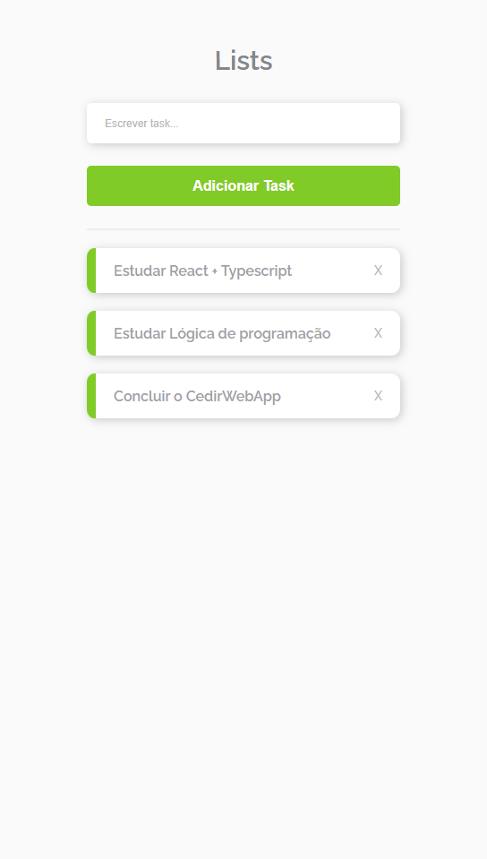

# ToDo List 

>Projeto 'ToDo List'

O Projeto 'ToDo List' Projeto construído seguindo as dicas do canal <b>Além Do Código</b> [YouTube](https://www.youtube.com/watch?v=O31jKT_5XI0)

[🔗 Clique aqui para acessar](https://todo-list-react-ts-nu.vercel.app/)

## 🌐 Tecnologias 

  
 
  
  

## 📱 Contato

